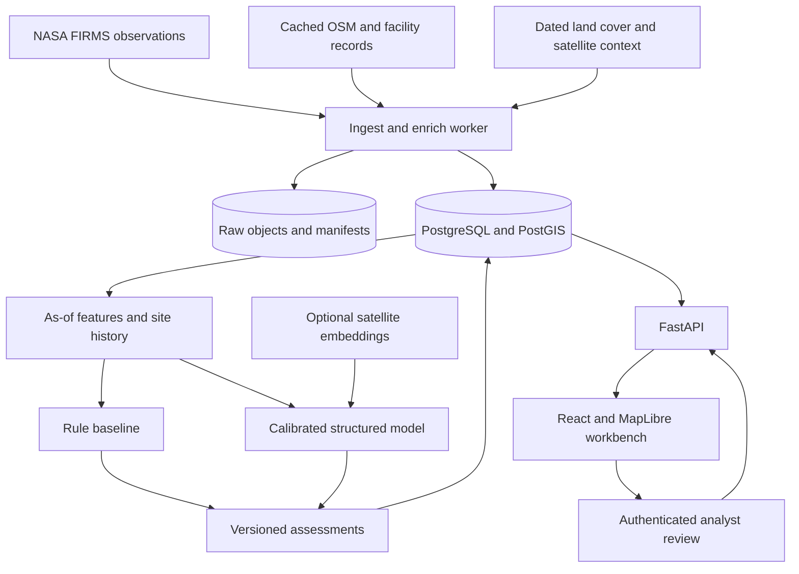

# ThermoScope architecture

Version 2.0 | 25 September 2026 | PS SIH26162, NTRO, Software, Disaster Management

Status: P01 foundation and P02 genuine observation ingestion/storage/API/map exist and pass local and clean-checkout CI checks (P02 commit `43cf2b0`). P03 context, land cover and events/sites (ADR-014 to ADR-016) and P04 history/rules (ADR-017) are technically integrated in `main`, independently reviewed with fixes and verified on macOS (ADR-020). Human domain review remains pending. P05's review/training pipeline exists on `p05-model`, pending reconciliation with main, independent acceptance and human labels; P06–P08 remain specifications. There is no independently evaluated learned model, reportable model accuracy or deployed service yet. This specification supersedes the old ThermalGuard plan for the new build only. Read `00-BRIEFING.md` first. Source references are in `RESEARCH.md`; release candidates and validation requirements are in `../ENVIRONMENT.md`.

## 1. Product decision and scope

Build an analyst workbench that classifies candidate thermal sources and identifies unusual behaviour relative to a site's observed history. Its mandatory PS outputs are industrial/non-industrial segregation and persistent GIS storage with map overlays. Monitoring, evidence and review make those outputs usable.

Choose the local folder design over Part 1 as the conceptual starting point. Keep raw detections, events, sites, source provenance, PostGIS, modular providers and an explicit unknown result. Reimplement from zero. The original code remains a historical reference, not an implementation to migrate piecemeal.

The innovation hypothesis is that site history plus geographic context and uncertainty can improve industrial-event triage over simple proximity and persistence rules. We must test that hypothesis. Using a foundation model, a map, or an LLM alone is not a novelty claim.

Initial geography: a bounded Indian pilot with a refinery/industrial region, a coal/steel region and an agricultural/forest comparison region. Candidate areas are Jamnagar, Singrauli and a Punjab/Haryana agricultural region. Boundaries, dates and sites are selected only after a coverage audit. A documented incident must have a usable matching satellite observation to be a detection case. Add an independent held-out region if coverage permits; do not select only visually convenient sites.

### Required user journey
1. Filter a map by region, time, source and review status.
2. Open an event to see thermal observations, possible facility associations and source confidence.
3. Compare the event with the site's earlier observations and dated satellite context.
4. Inspect likely source, behaviour, uncertainty and the evidence for review priority.
5. Acknowledge, annotate or revise a review decision without overwriting model history.
6. Export GeoJSON/CSV and an evidence report that can be reproduced from a manifest.

### Not promised
Continuous observation; ignition-time alerts; exact fire perimeter or flame temperature from FIRMS; gas-leak or explosion confirmation; emergency dispatch; proof of infrastructure damage; nationwide operational coverage; calibrated accident probability. These require different evidence or validation. The system is decision support.

## 2. Major changes from the old specification

| Old choice or gap | Fresh-build decision | Reason |
|---|---|---|
| Generic RGB ResNet-50 required before full completion | Tabular baseline; AlphaEarth context candidate; Prithvi tiny experiment later | Better alignment with satellite context and limited labels |
| Static land cover treated as timeless | Dated baseline raster; recent imagery; optional Dynamic World | Age and uncertainty affect interpretation |
| Single industrial/non-industrial tree mixes event and facility types | Separate source, behaviour, facility and review states | A refinery is not an incident class |
| A model/risk number can appear authoritative | Calibrated class estimates, separate review priority and explicit abstention | Avoid false certainty |
| Phase 0-9 versus P0-P2 versus saved P3 | One P01-P08 milestone system | Make handoffs unambiguous |
| Centroid-distance context | Footprint-aware candidate associations with ambiguity | A nominal satellite pixel covers multiple possible sources |
| Per-event Overpass requests | Regional cached OSM snapshots, bounded refresh | Avoid request amplification and fragile demos |
| Redis and a distributed queue required | One scheduled worker with Postgres job records and leases | Enough for regional scope; fewer services |
| Images closest to event may be later | As-of availability contract; later imagery only in a labeled retrospective view | Prevent temporal leakage |
| Continuity narrative can go stale | Evidence-indexed state, task ownership and saved checks | Claims must survive a fresh session |

The old architecture already discussed label provenance, spatial splits and abstention. This revision makes them enforceable contracts and release gates, rather than claiming they are entirely new ideas.

## 3. Runtime design

Use a modular monolith: API, worker, PostgreSQL/PostGIS and static frontend. Store raw CSV/JSON, COG windows, features and model artifacts in a local object-store adapter; use an approved S3-compatible bucket in cloud. No Kafka, Kubernetes, vector database, graph database, live LLM inference or custom foundation-model training is required.

One worker process handles scheduled jobs initially. A database job has `id`, `kind`, `idempotency_key`, `payload`, `status`, `attempt`, `lease_owner`, `lease_expires_at`, `heartbeat_at`, `run_after`, and sanitized error information. Claim with a transaction/row lock; renew leases; recover expired leases. Use bounded retries with jitter and an exhausted state. Idempotence is required because jobs may run twice. No Redis until measured concurrent workload justifies a queue; record that change in an ADR.

Development: Docker Compose for database and app services. Cloud pilot: one small CPU VM or equivalent managed container deployment plus persistent database volume and backed-up object storage. Keep PostgreSQL off the public network. A single VM is a pilot deployment, not high availability. An optional separate GPU batch job produces embeddings and terminates after completion.

## 4. Data contracts

### 4.1 Four kinds of time
Every source-derived record distinguishes `acquired_at` (satellite observation), `source_published_at` when known, `first_available_at` (earliest defensible availability), and `ingested_at` (our receipt). Features also record `as_of` and the source snapshot IDs used.

For operational replay, an input is eligible only if its observation time and known availability are at or before `as_of`. Where historical availability is unknown, mark `availability_evidence=UNKNOWN` and label the analysis retrospective; do not silently assume acquisition equals availability. Labels may be corroborated later, but future features cannot enter a prediction at an earlier time.

### 4.2 Raw thermal detections
Store provider, product, collection/version, sensor, satellite, coordinates, acquisition time, day/night, FRP in MW, scan/track dimensions in km, sensor-specific brightness temperatures in kelvin, source confidence, raw payload URI/hash, data mode and ingestion run.

- VIIRS: map `bright_ti4` and `bright_ti5`; confidence is categorical low/nominal/high. MODIS has a different schema and numeric confidence. Keep raw confidence and do not transform it into the model's probability.
- Brightness temperature is not flame or facility surface temperature. FRP is not temperature or damage.
- Preserve `type` where provided. NASA documents it for standard-quality products, not the NRT stream. It is a broad source attribute, not confirmed industrial incident truth. Keep it out of operational NRT features; evaluate it separately as a retrospective baseline where available.
- Retain original detections and revisions. NRT and standard products can overlap; assign a physical-observation identity and explicit revision/supersession relation. Do not count the same observation twice after product reconciliation.
- Stable identity must include product/sensor, time and source coordinates or provider ID. Retain original coordinate precision and hash the normalized identity version. Detect collisions and document rounding.
- Reject or quarantine malformed rows individually with reason/count; do not fail an entire valid batch for one row. Reject impossible coordinates, negative FRP and impossible timestamps; preserve null versus zero.
- Use unique constraints and atomic upserts. A SELECT-before-INSERT check alone is not concurrency safe.

NASA's Area API currently documents 1-5 days per request. Query supported product availability, split historical requests into allowed windows, and use the archive route for longer backfills where appropriate. Do not assume the NRT endpoint provides every historical window. Initially poll a bounded region every 15 minutes with overlapping windows, pagination where supported, backoff and a checkpoint. Revalidate limits at implementation. Never log key-bearing request paths.

### 4.3 Geography and association
Store source geometry in EPSG:4326. Calculate distances/areas with PostGIS geography or an appropriate local projection. API GeoJSON uses longitude, latitude order. Validate coordinate systems and geometry before ingestion.

A FIRMS point is the nominal pixel centre, not an incident boundary. Represent positional context with scan/track dimensions when available and a documented uncertainty buffer. If footprint orientation is unknown, draw an approximate support region and label it approximate, not an exact sensor polygon. Never render decorative flame blobs as observed fire extent.

Associate a detection with multiple plausible facilities inside/near its support region, retaining distance, overlap, source and ambiguity. The nearest facility is not automatically responsible. A missing OSM polygon is not evidence that there is no industry.

### 4.4 OSM and facility context
Use regional OSM extracts or bounded cached Overpass responses with source IDs, snapshot dates and tags. Start with industrial land use, works, power plants/generators, refineries, storage, LNG and mines/quarries. Preserve node/way/relation identity and complete polygon geometry; relation centroids are not substitutes for boundaries.

Facility type is a distinct field: refinery, petrochemical, steel, power, LNG, mine, other, unknown. Independent public registries can corroborate identity if licensed and dated. Add a coverage/missingness flag. Do not infer sensitive operational details or claim access to NTRO internal systems.

Current OSM applied to old observations is a retrospective assumption; record it and test its effect. Historical replay must use a defensible historical snapshot or disclose the gap.

### 4.5 Land cover and imagery
Use a downloaded, dated land-cover baseline such as WorldCover with its year displayed. Summarize fractions over the support region and context buffers rather than only the centre pixel. Raster nodata stays missing. Land-cover class or model probability is evidence, not a verified fire label.

Sentinel-2 L2A provides contextual optical/SWIR observations; it has no thermal infrared band. Choose a provider through a STAC adapter and pin collection/item IDs, band names, scale/offset, QA masks, CRS and capture time. HLS is the preferred prepared input for the Prithvi experiment. Cloud percentage for a whole scene is insufficient: measure valid pixels inside the actual patch.

In current-operation mode use the newest acceptable available pre-event context within a configured maximum age, initially 60 days. Mark stale or missing context and continue with the structured path. A before/after display may show later imagery, explicitly labeled as subsequent corroboration and excluded from the earlier prediction. Resample continuous bands and masks with appropriate, different methods; never interpolate class masks as reflectance.

Optional Dynamic World gives dated land-cover probabilities if Earth Engine access is approved. It is not necessary for the initial release. Keep the baseline functioning when cloud or service access removes recent imagery.

### 4.6 AlphaEarth context candidate
Read public COG windows for a completed eligible year. Apply the documented de-quantization, nodata handling and vector normalization. Aggregate valid embeddings over the support region; retain year, tile, validity fraction, extraction version and file hash. Cache extracted features, not global rasters.

Annual embeddings describe accumulated geographic context; they do not show a current fire. Select by availability as well as year. A 2025 layer cannot be used for a 2025 event just because the label says 2025. Earlier events predating the product release cannot support an “available then” deployment claim using that product. Keep modern retrospective experiments separate from operational replay. Record possible pretraining overlap with study imagery.

### 4.7 Optional Prithvi experiment
Candidate: `ibm-nasa-geospatial/Prithvi-EO-2.0-tiny-TL`; freeze a verified model revision/checksum and license before use. Use correct multispectral inputs, channel order, masks, scaling, dates and patch geometry from the model card; do not send an arbitrary RGB map screenshot. Start with frozen embeddings and a small trained head, then consider fine-tuning only if warranted.

A model artifact contains preprocessing and encoder revisions. Disclose geolocation information in TL embeddings and compare a location-disabled configuration where supported; these features can memorize regions. The baseline remains available when imagery is missing. Do not train a larger network just to list a fashionable technology.

## 5. Detection, event and site identity

`Detection` is a sensor observation. `Event` is a bounded episode of related detections. `Site` is a recurring geographic source. One site can have many normal or abnormal episodes. A wildfire can move; a persistent industrial site should not drift indefinitely through chaining.

Initial event association: process eligible observations in deterministic acquisition order; compare time gap, source pixel support and spatial overlap against open events. Pilot starting parameters are a 24-hour maximum gap and a 750 m VIIRS association distance, subject to footprint rules. These are tunable engineering defaults, not physical laws. Use a maximum event diameter and explicit split/merge lineage to prevent chain-link grouping across neighbouring facilities. Test alternatives on annotated episodes.

Maintain site assignment separately with stable geometry and association uncertainty. Deduplicate simultaneous revisits before aggregating. Do not sum FRP over different overpasses as though they were one instantaneous measurement. Keep per-overpass totals, maxima and sensor groups separately.

Late arrivals trigger a versioned recomputation from the earliest affected checkpoint. Previous predictions and review actions remain addressable; never silently rewrite a past assessment.

## 6. Source, behaviour and priority

### Source taxonomy v1
`INDUSTRIAL`, `VEGETATION_FIRE`, `AGRICULTURAL_BURN`, `OTHER`. Abstention returns `UNKNOWN` with reason; it is not a forced fifth semantic class. If labels do not support a vegetation/agriculture separation, release a combined non-industrial class and report that scope honestly.

### Industrial subtype
`GAS_FLARE`, `OTHER_PERSISTENT_HEAT`, `MINING_HEAT`, `UNRESOLVED`. Facility categories remain separate. `INDUSTRIAL_FIRE` is supported only by a validated incident classifier or independent reviewed incident evidence; an unusual FRP pattern alone returns `POSSIBLE_ABNORMAL_INDUSTRIAL_EVENT`.

### Behaviour
`RECURRENT_WITHIN_BASELINE`, `ABNORMAL_RELATIVE_TO_BASELINE`, `NEW_OR_TRANSIENT`, `INSUFFICIENT_HISTORY`. “Within baseline” means within the observed record, not certified safe operation.

Use 7/30/90/180-day historical windows before `as_of`. Features include distinct active days, overpasses, gaps, robust FRP distribution, dispersion, source/daynight groups and context availability. Detection frequency per calendar day is observed recurrence, not a probability of burning. Satellite non-detection is not a negative observation. A true opportunity-normalized rate needs coverage/cloud masks; leave it unavailable until that denominator is measured.

For adequate matched history, compute robust change using median and MAD, plus quantiles. Compare like sensor/daynight groups. Handle MAD=0 with a minimum scale and explicit flag, cap unstable ratios, and require minimum history. Calibrate abnormality thresholds on a development set and freeze them. A 180-day window does not require waiting 180 days if valid historical data can be obtained.

### Uncertainty and explanations
Calibrate probabilities on an independent validation split. Choose abstention thresholds from validation risk/coverage curves; do not call an arbitrary 0.55 threshold scientifically established. Abstain for insufficient evidence, low calibrated confidence, conflicting associations or validated out-of-distribution checks. Unknown is a review state, not a silent error.

Every assessment records model/rule path, source probabilities if meaningful, behaviour, confidence/calibration version, missing data, reasons and source IDs. Rules produce a heuristic score with explicit wording, never a model probability. Use stable feature-based reason templates. SHAP may explain tabular contributions when compatible, but a contribution is not a causal explanation and should not replace visible source evidence.

Priority v1 uses transparent ordered criteria (high/medium/low/review) based on abnormality, industrial plausibility, evidence completeness and proximity to public infrastructure. Avoid a 0-100 score until its meaning is defined and validated; if later used, name it review priority, not accident probability or expected damage. Do not suppress a case solely because its site is historically persistent.

## 7. Labels and evaluation

### Label record
Store `case_id`, `site_id`, `episode_id`, `as_of`, candidate label, final label, independent evidence URLs/IDs, evidence date, reviewer, review time, certainty, disagreement, geographic uncertainty, licensing and label tier. Separate source identity labels from incident labels.

Tiers: `GOLD` (independent evidence with human review), `SILVER` (corroborated but limited), `WEAK` (heuristics only), `UNRESOLVED`. Weak rules may propose training labels; they cannot become test truth merely because the same rules agree with the model. Two reviewers inspect the test set and adjudicate disagreements. AI prepares case material; it does not certify its own predictions as independent labels.

For industrial incidents, prefer official/company/fire-service reports with date and location and independent imagery corroboration where available. News can be secondary evidence with limitations. For recurring sites, confirm facility identity and repeated behaviour, but do not equate recurrence with a safe process or an incident label. Flare catalogues are optional corroboration subject to access terms. Agricultural versus vegetation labels require appropriate independent context.

### Sampling and partitions
Create a source inventory before selecting a final model. Working target for a first research pilot: 300-600 reviewed site-time cases across at least 60 distinct sites and multiple regions, subject to available evidence. This is a collection target, not a sufficiency guarantee or existing dataset. Rare industrial incidents may require a separate case-study evaluation. Report actual support and refrain from robust class-level claims when it is too small.

Freeze site/episode groups before feature fitting. Use site-disjoint train/validation/test groups, a held-out geographic region and a forward-time test where feasible. Purge overlapping history windows and nearby duplicates across boundaries. Group uncertain facility matches conservatively. Raw lat/lon, facility IDs and names are excluded from the default supervised inputs. Imputation, scaling, feature selection and calibration fit only on permitted training/validation partitions.

Keep a separate named protocol for unseen-site generalization and known-site future monitoring. They answer different questions and cannot share one misleading pooled score. A query held out in time may still use genuinely earlier site history when testing known-site monitoring; it may not use future observations or fitted parameters from the test period.

### Baselines and ablations
Compare on identical frozen cases:
1. Proximity-only rules (explicitly heuristic).
2. Thermal plus temporal baseline.
3. XGBoost with spatial/land-cover context.
4. The same model plus AlphaEarth context.
5. Optional Prithvi features on the eligible imagery subset, with matched comparison cases.

Test removal of history, industrial context and embeddings. Test missing imagery, unmapped industry, industrial/agricultural adjacency, sensor changes, persistent sources with genuine abnormal episodes, low FRP and cloud gaps. Do not compare a tiny favourable image subset with the baseline's harder full set.

### Required report
Per-class support, confusion matrix, precision/recall/F1, macro-F1, PR-AUC where useful, Brier score/reliability plot, abstention coverage and error by region/sensor. Report metrics on covered predictions and overall coverage; do not hide rejected cases. Use site-cluster bootstrap intervals where feasible. Include false alerts per monitored site-day with an explicit denominator and incident recall only for eligible verified incidents.

Measure pipeline latency separately from satellite acquisition/publishing delay. Record map query performance and successful offline replay. No population impact, avoided loss or response-time claim without a dedicated study.

Promotion gate: better relevant held-out results than the baseline, acceptable uncertainty, documented errors and reproducible inference within the chosen budget. Set numerical operating goals after a baseline and before test-set inspection. If no gain is supported, ship the simpler model and report the comparison.

## 8. Storage schema and APIs

All IDs are UUIDs unless a provider has a stable identifier. All times are UTC timestamps with timezone. Apply GiST geometry indexes and time/filter indexes; add partitioning only after measured need.

| Entity | Minimum key information |
|---|---|
| `source_snapshots` | provider, product/version, period, availability, URI/hash, license |
| `ingestion_runs` | snapshot, counts fetched/accepted/rejected, status, sanitized errors |
| `detections` | physical identity, sensor fields, point/support, time, raw reference, revision |
| `events`, `event_detections` | episode geometry, bounds, counts, lineage, constituent observations |
| `sites`, `event_sites` | persistent source geometry, association/version, uncertainty |
| `facilities`, `facility_snapshots` | source IDs, type, geometry, tags, validity/snapshot dates |
| `context_assets` | imagery/land-cover/embedding IDs, availability, quality, geometry, hashes |
| `feature_snapshots` | event/site, as_of, schema version, source IDs, feature artifact hash |
| `labels` | reviewed truth, evidence, tier, reviewer and disagreement |
| `dataset_versions`, `split_memberships` | manifests, grouping/split policy, immutable hashes |
| `model_versions` | algorithm, artifact/preprocessing hashes, data/split IDs, metrics |
| `assessments` | feature snapshot, output axes, probabilities, reasons, superseded assessment |
| `alerts`, `reviews`, `audit_log` | lifecycle, reviewer actions, timestamps and prior state |
| `jobs` | idempotency, lease, attempts, scheduling and failure status |

Do not require all tables in P01. Add them with the milestone that uses them. `dataset_versions` references source data; do not duplicate multi-gigabyte rasters inside PostgreSQL.

### API v1
- `GET /health/live`, `/health/ready`: process and dependency status; no secret configuration.
- `GET /api/v1/sources`: freshness, last successful run, unavailable/stale status.
- `GET /api/v1/events?bbox=&from=&to=&source_class=&review_state=&cursor=&limit=`: bounded, validated query.
- `GET /api/v1/events/{id}`: source, behaviour, priority, evidence, uncertainties and versions.
- `GET /api/v1/events/{id}/timeline`, `/evidence`, `/assessments`: separate history and current assessment.
- `GET /api/v1/sites/{id}`: recurrence and site baseline with sample counts.
- `GET /api/v1/map/events.geojson`, `/facilities.geojson`: bbox/time-limited; cap features and declare truncation. Add vector tiles only if profiling requires them.
- `POST /api/v1/reviews`: authenticated append-only review; no direct model-label overwrite.
- `POST /api/v1/exports`: authenticated bounded export job; retrieve a scoped result.
- `GET /api/v1/jobs/{id}`: job progress and sanitized failure.
- Admin ingestion/recompute is a CLI command or authenticated administrative endpoint, never a public write route.

Use an explicit response schema, generated OpenAPI, cursor pagination, request IDs and structured error codes. Export typed API contracts for the frontend. Error bodies use `code`, `message`, `request_id`, `retryable`; no stack traces or tokens.

## 9. Analyst workbench

React/TypeScript, Vite and MapLibre GL JS. MapLibre is chosen for vector/raster overlays and clustering, not because Leaflet is invalid. Keep UI architecture simple: map, filters, event list, evidence panel, history chart, review actions and data-source status. A WebGL failure must give a useful event-list fallback.

Use consistent legends and labels; combine colour with symbols/text. Show `LIVE`, `HISTORICAL_REPLAY` or `SYNTHETIC_FIXTURE` persistently. Display last acquisition, last update and provider age. Missing imagery does not render an empty box without explanation. Include an uncertainty support region, not an asserted fire perimeter.

Use historical replay for demonstration, with source manifests. Provide an offline bundle with allowed imagery, cached case data, local model and a legally redistributable/self-hosted basemap. Do not prefetch the public OSM tile service for offline use. Show source attribution in map, screenshots and exports.

## 10. Security, operation and data rights

Use TLS at deployment; explicit allowed origins; authentication for writes/admin/export; parameterized DB access; input/file-size limits; rate limits and bounded geometry/time requests. Public demo is read-only. Training and inference load only trusted, hashed artifacts; do not load arbitrary pickle uploads. Provider adapters allow only configured hosts, not arbitrary user URLs.

Secrets live in ignored local environment files or an approved secret manager. FIRMS credentials appear in URL paths, so redact request URLs and exception strings. Keep authentication out of browser bundles and public logs. `.env.example` contains placeholders only.

Source licenses and attribution live in `DATA_SOURCES.md`. OSM attribution and database obligations, imagery terms, embedding attribution, model licenses and any Nightfire license are handled separately from the application's code license. Do not bundle data whose redistribution is unverified.

Record structured logs, job counts, provider freshness, rejection rates, latency and model version. A provider outage creates a visible degraded state; no fresh timestamps on old data. Back up database/object manifests and test one restore into a disposable environment. Record storage/compute usage and automatic GPU shutdown. No operational claim until these checks pass.

## 11. Reproducibility and engineering tests

The implementation must expose documented commands for environment checks, tests, ingest, train, evaluate, replay and release packaging. Names are contracts to implement, not existing commands: `make doctor`, `make check`, `make integration`, `make e2e`, `make replay`, `make train`, `make evaluate`.

Minimum meaningful tests:
- Sensor parsing and units; malformed rows; UTC/date edges; raw provenance.
- Duplicate/revised ingestion; concurrent retry; partial provider failure and resume.
- Metre distances, coordinates, nodata masks and ambiguous facility association.
- Deterministic event construction, neighbouring-site separation and late arrivals.
- No future feature/imagery/annual-layer leakage; fixed split manifests with no group overlap.
- Model/rule probability semantics, abstention, history insufficiency and missing-image path.
- Real PostGIS migration/upsert queries in disposable containers, not SQLite substitutes.
- Browser workflow: select case, compare history, inspect evidence, review, export and offline replay.
- Fresh clone and frozen dependency installation; no secret strings in tracked artifacts; reproducible model inputs/outputs within stated numeric tolerance.

Test actual risks rather than asserting that constants equal themselves. Store commands, exit status, relevant artifacts and commit in the evidence ledger. Claims of production performance require real measurement, not fixture test success.

## 12. Build order and scope gates

`BUILD_PLAN.md` defines exactly eight milestones P01-P08. P01-P04 produce the usable geospatial workflow; P05 establishes reviewed data and baseline; P06 evaluates satellite context; P07 completes review/replay; P08 verifies release and submission evidence. Submission drafting can proceed in parallel with engineering, but never substitutes proposed behaviour for built behaviour.

Before coding: complete credential/setup checklist, select region/date sample, freeze environment candidates after a clean compatibility check, and confirm a named task owner. No image experiment blocks a coherent submission. No deployment or external message is an implied automatic next step of a successful local test.
